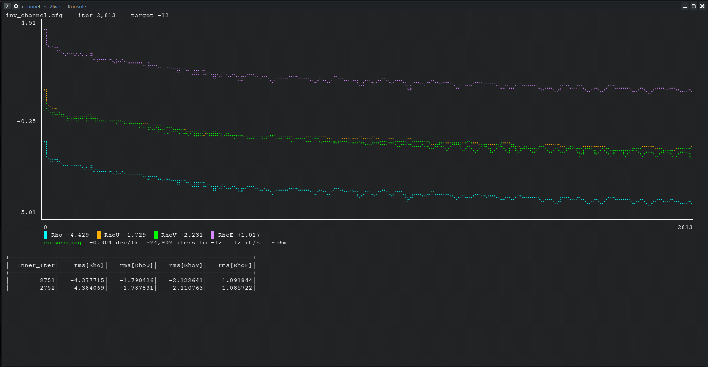
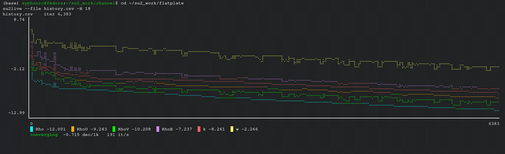
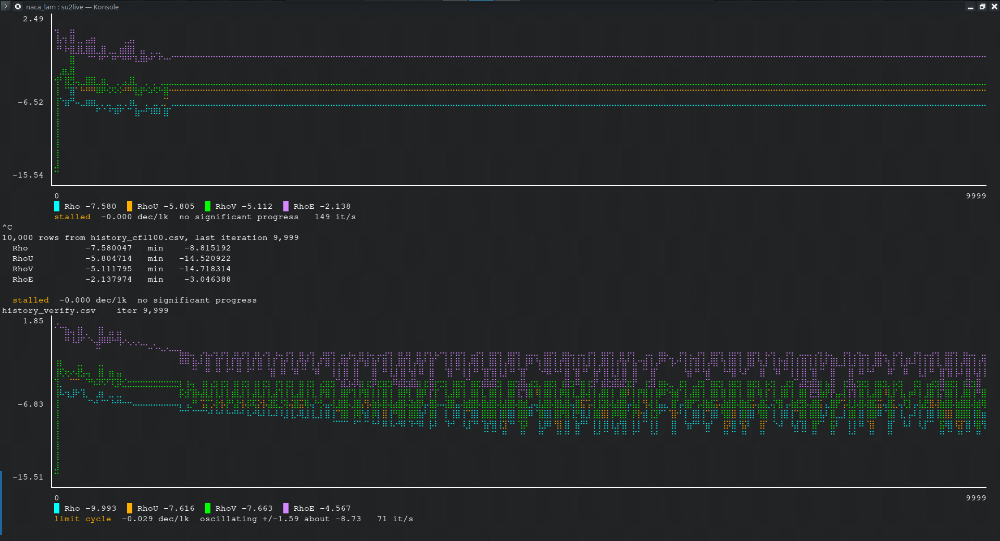

# su2live

Live residual plots for [SU2](https://su2code.github.io) runs, in the terminal.

SU2 prints a convergence table while it solves. It tells you what the residuals
are right now, but not what they are doing: whether the run is converging or
just oscillating, how fast it is going, or how long it has left. Answering that
usually means waiting for the run to finish and then plotting `history.csv`.

`su2live` plots the residuals as they are written, and says what it thinks is
happening.




Pure Python, no dependencies, works over SSH.

## Install

```bash
pipx install su2live
```

`pipx` keeps the tool in its own environment, so a system Python upgrade
won't break it. Plain `pip` works too:

```bash
pip install su2live
```

or from a clone, for development:

```bash
git clone https://github.com/Syphonicc/su2live
cd su2live && pip install -e .
```

### If `su2live` stops working after a system update

`ModuleNotFoundError: No module named 'su2live'` usually means your distro
moved to a new Python version and the old install is stranded in the previous
version's `site-packages`. Reinstall:

```bash
pip install --force-reinstall su2live
```

Editable installs need `pip install -e .` again from the clone.

## Use

Run a case and watch it:

```bash
su2live inv_channel.cfg
```

This runs `SU2_CFD` for you, reads the history file as it is written, and shows
the last few lines of solver output under the plot. Ctrl-C stops both and
prints a summary.

Follow something already running, or a finished run:

```bash
su2live --file history.csv
```

Useful flags:

| Flag | Meaning |
|---|---|
| `--exec`, `-e` | solver to run (default `SU2_CFD`) |
| `--window N`, `-w` | plot only the last N iterations |
| `--interval S`, `-i` | seconds between redraws (default 0.25) |
| `--tail N`, `-t` | lines of solver output to show (default 5) |
| `--target X` | convergence target, overriding `CONV_RESIDUAL_MINVAL` |
| `--fullscreen`, `-F` | take over the terminal instead of drawing in place |
| `--height N`, `-H` | plot height in rows (default 14 inline, 26 fullscreen) |
| `--only A,B`, `-o` | plot only these residuals |
| `--list`, `-l` | list the residual columns in a history file and exit |

By default the plot is drawn in place at the bottom of the terminal and
redrawn where it stands, so everything above it stays in the scrollback and you
can still scroll back through earlier output while a run is going.
`--fullscreen` uses the alternate screen buffer instead, like `htop`: the plot
gets the whole window and your terminal is restored untouched on exit.

## What it tells you

Residual columns are discovered from the history header, so Euler (4), SA (5)
and SST (6) all work without configuration. Six curves at once is often more
than you want, so you can pick:

```bash
su2live --file history.csv --list        # Rho RhoU RhoV RhoE k w
su2live --file history.csv --only Rho    # just the one
su2live --file history.csv -o k,w        # just the turbulence residuals
```

Selecting also rescales the vertical axis to the chosen series, which matters
when one residual sits several decades away from the rest and flattens
everything else.



Alongside the plot it reports:

- **converging** with the rate in decades per 1000 iterations, and an estimate
  of the iterations and wall time remaining to reach the convergence target
- **stalled** when the residual stops making progress
- **limit cycle** when it oscillates about a level instead of descending, which
  is easy to mistake for slow convergence over a short window
- **frozen** when the residual stops changing to floating point precision
- **diverging** before the solver gives up on it



The last three are the ones worth catching early. A case that has settled into
a cycle at -7 will still be at -7 in forty thousand iterations, and it does not
look any different from slow convergence if you are watching a single number
scroll past.

## Unsteady runs

`Inner_Iter` restarts every physical time step, so on an unsteady run it is
either constant or a sawtooth and cannot be used as a horizontal axis. The
column set is checked once enough rows have arrived, and the plot falls back to
`Time_Iter`, or to the row number, whichever is monotonic.

## Tests

```bash
python tests/test_su2live.py
```

Covers the convergence classifications, `nan` handling, unsteady axis
selection, and incremental reading.

## Notes

The history file is read rather than the solver's stdout, because
`SCREEN_OUTPUT` frequently shows fewer residuals than the CSV contains — an SST
run writes `rms[k]` and `rms[w]` to the file whether or not they appear on
screen.

When wrapping a run, any existing history file is moved aside to `.prev` so the
plot shows only the current run.

Rendering uses braille characters, giving 2x4 addressable points per terminal
cell. Frames are written in a single call and each line is cleared to the end
as it is drawn, so redrawing does not flicker.

## License

MIT
